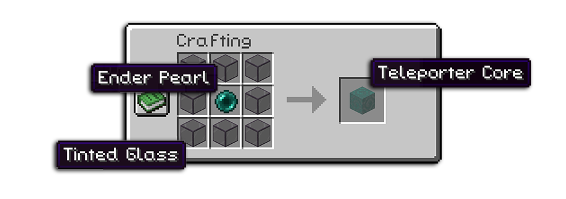
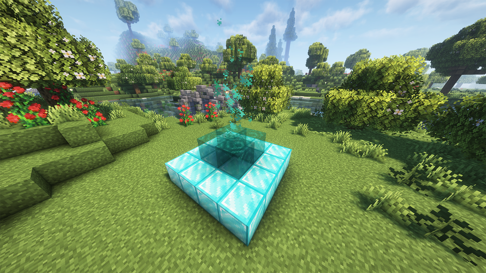
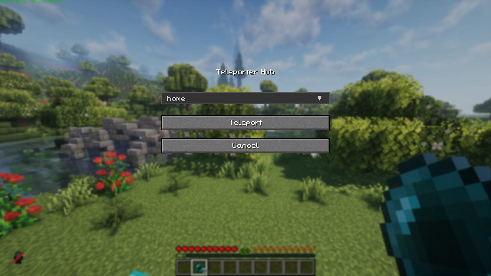

  

## 📖 Overview

Drafu Teleporters brings a balanced teleportation system to your Minecraft world without breaking the vanilla experience. Create networks of teleporters using diamonds and ender pearls to travel instantly across your world!

> _Built for **Minecraft 1.21.4** with **Fabric** mod loader_

**🎥 Watch a video demo of the mod on YouTube:**  
[▶️ Drafu Teleporters Showcase](https://www.youtube.com/watch?v=YBwEdOlI-fE)

## 📋 How to Use

### Crafting the Teleporter Core

Create teleporter cores by placing **1 Ender Pearl surrounded by 8 Tinted Glass = 1 Teleporter Core**. You will need 4 of them for every teleporter you want to build.

  

### Building a Teleporter

Base Structure: Create a 4×4 platform using 16 Diamond Blocks \
Core Placement: Place 4 Teleporter Cores in a 2×2 pattern in the center, on top of the diamond base

  

### Activating a Teleporter

- Stand on top of the teleporter structure
- Drop a named Ender Pearl (rename it using an anvil)
- The teleporter will adopt the name of the pearl you threw

> [!IMPORTANT] 
> Teleporters can only be activated in the Overworld and no other active teleporter can be within 100 blocks.

### Using the Teleporter

- Stand on top of an active teleporter
- Drop a regular (unnamed) Ender Pearl
- A GUI will open showing available destinations
- Select your destination and click "Teleport"

  

### Deactivating a Teleporter

Simply break any part of the structure to deactivate the teleporter.

## 🔗 Links

DrafuModPack: [https://github.com/DragoonXVIII/DrafuPack](https://github.com/DragoonXVIII/DrafuPack) \
My Website: [https://febru.dev](https://febru.dev)
